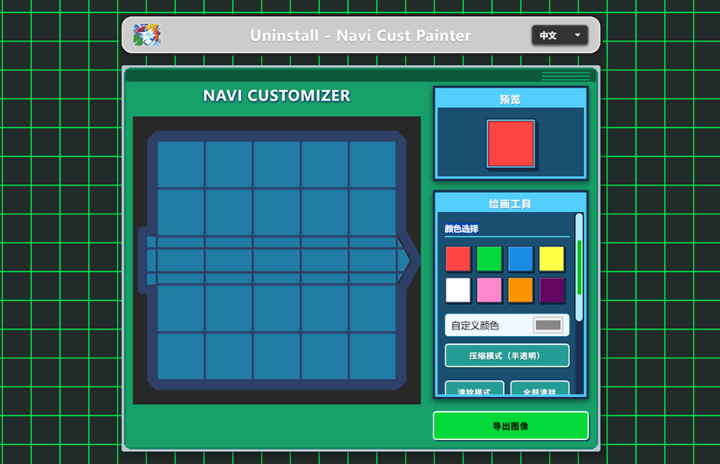

<div align="center">
  
</div>

#  Uninstall - Navi Cust Painter Ver 2.0.0


### 🌐  **[Play Online / 网页链接](https://bluestarbls.github.io/Uninstall_NaviCustPainter/)** 

A web-based art tool inspired by Mega Man Battle Network.

基于《洛克人EXE》领航员自定义系统风格的网页绘图工具。

## 📖 Introduction / 简介

### English
**Uninstall - Navi Cust Painter** is an interactive, frontend-only web application designed for fans and artists. It lets you draw 5x5 grid patterns mimicking the classic **"Navi Customizer"** interface from the *Mega Man Battle Network* series. Precise color tuning, dynamic pattern switching, JSON save/load mechanics, and an image export system for sharing your Navi programs.

### 中文
**Uninstall - Navi Cust Painter** 是一款基于《洛克人EXE》系列经典 **“领航员自定义系统”（Navi Customizer）** 的网页版交互式像素绘图工具。支持5x5网格作画、自定义颜色选择、花纹叠加、压缩模式、JSON 存档导入导出，以及自带透明通道的图像导出功能。

## 🚀 Quick Start / 快速开始

This tool runs entirely in the browser with no backend or compilation required.
本工具为纯前端实现，无需任何后端环境或编译步骤。

### English
1. **Download**: Clone the repository or download the ZIP file.
   ```bash
   git clone https://github.com/BLueStarBLS/Uninstall_NaviCustPainter.git
   ```
2. **Run**: Navigate to the directory and simply open `index.html` in any modern web browser.
3. **Draw & Export**: Create your design, play with patterns, save your JSON config or hit **"Export Image"**!

### 中文
1. **下载**: 将本仓库 Pull 到本地，或直接下载打包的 ZIP 压缩文件并解压。
   ```bash
   git clone https://github.com/BLueStarBLS/Uninstall_NaviCustPainter.git
   ```
2. **运行**: 打开文件夹，直接双击运行主目录下的 `index.html` 即可在浏览器中使用。
3. **绘图与导出**: 选择你喜欢的颜色与花纹区块，绘制完毕后可使用右侧功能面板保存设计存档，或直接打包成图片导出！

## 🛠️ Features / 特性功能

* **Dynamic Pattern Rendering**: Uses `p5.js` for drawing and rendering.
  > 采用 `p5.js` 实时渲染。
* **Config Data Export/Import**: Export your painting data into a JSON file, and securely reload it to keep drawing later!
  > 支持将你的杰作无损导出为 JSON 配置文件，也可以随时载入以前的配置。
* **Bilingual Locale**: Real-time language switching between English and Chinese inside the tool.
  > 支持中英双语实时切换。

## 🙏 Acknowledgements / 特别感谢

### English
* **Capcom**: For creating the legendary *Mega Man Battle Network* series and its iconic Navi Customizer system.
* **MMBN Wiki Community**: For preserving game knowledge and graphical references.
* **Rockman EXE & Shooting Star Rockman - Square** QQ Group: 1135443745

### 中文
* **Capcom（卡普空）**：感谢其打造了经典的《洛克人EXE》系列以及其充满魅力的领航员自定义系统。
* **[洛克人EXE & 流星洛克人 电波网络战斗 WIKI](https://wiki.biligame.com/wavebattlenetwork)**：感谢爱好者社区与百科提供的大量专业游戏资料以及设计参考。
* **洛克人EXE & 流星洛克人 - 广场** QQ群：1135443745

<div align="center">
  <small>© Uninstall NaviCust Painter | Ver 2.0.0 | <a href="https://github.com/BLueStarBLS">★BLueStarBLS</a></small>
</div>
